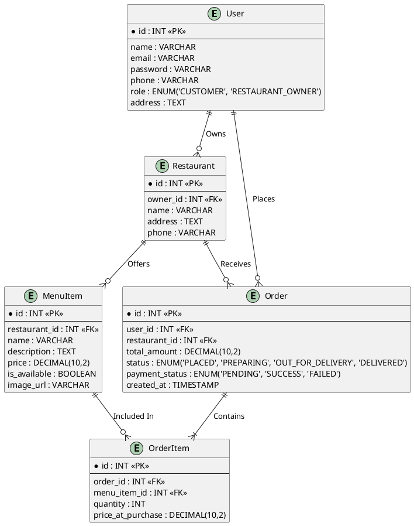
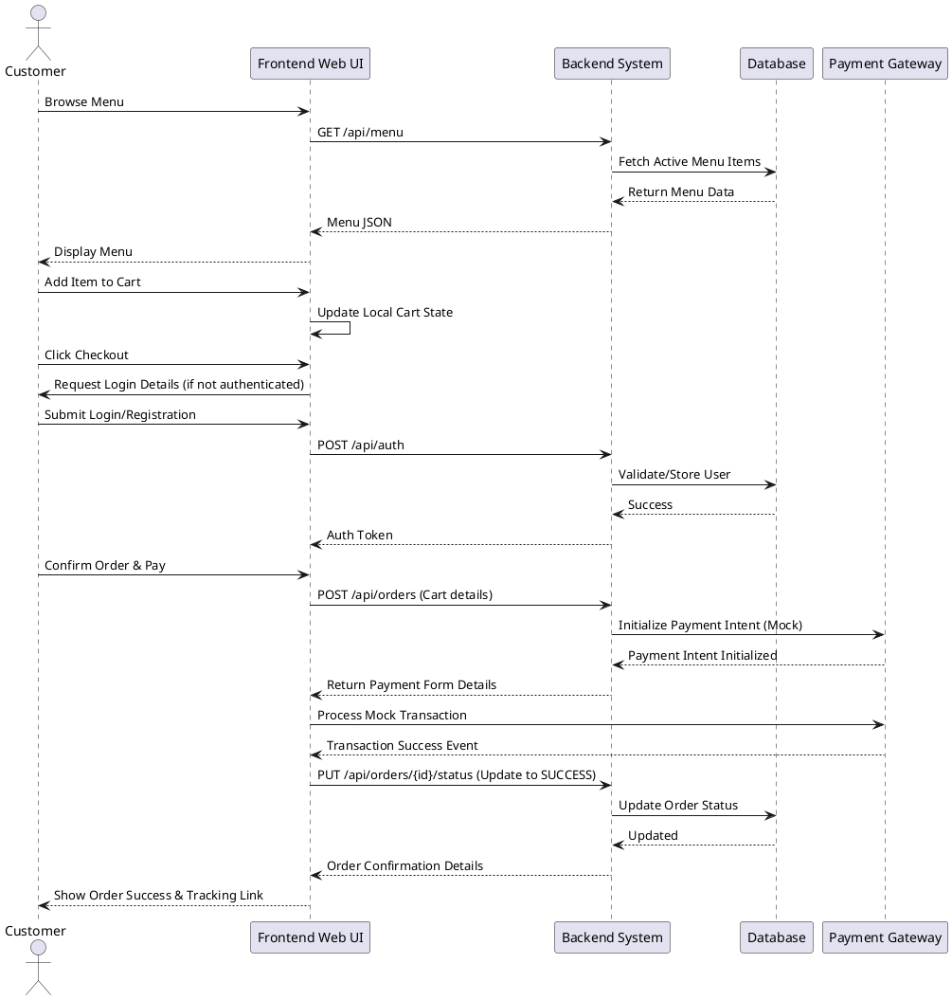

# Online Food Ordering System - Client Deliverables

## Technical Stack Overview
- **Backend:** Node.js / Express.js (pivot from Django for system compatibility)
- **Frontend:** React.js (Vite)
- **Styling:** Vanilla CSS (Modern Aesthetics, Glassmorphism)
- **Database:** In-memory Mock Store (easily migratable to SQL)
- **Authentication:** JWT (JSON Web Token) with bcrypt hashing

## 1. Software Requirements Specification (SRS)

### 1.1 Purpose
The purpose of this document is to outline the requirements for a web-based Online Food Ordering System. This system allows customers to browse menus, add items to a cart, place orders, and track them, while enabling restaurants to manage their offerings and track incoming orders.

### 1.2 Scope
The application includes:
- **User Authentication:** Login and Registration for customers and administrators.
- **Menu Management:** Restaurants can add, update, or remove menu items. Customer view of the menu.
- **Cart & Checkout:** Customers can select items, review their cart, and proceed to checkout.
- **Payment Integration:** Secure dummy gateway for handling mock payments.
- **Order Tracking:** Customers and restaurant owners can track the state of the order from 'Placed' to 'Delivered'.

### 1.3 Target Audience
- Customer base, particularly from 2nd tier cities preferring an intuitive system in familiar settings.
- Restaurant Owners looking to digitize their storefront experience.

---

## 2. ER Diagram (PlantUML)

This diagram can be copied directly into Draw.io (using Arrange > Insert > Advanced > PlantUML) or rendered via any PlantUML viewer.

---

## 3. Sequence Diagram (PlantUML)

This sequence diagram depicts the flow from browsing the menu to checkout.

---

## 4. Test Cases

| Test Case ID | Module | Scenario | Expected Outcome | Status |
|---|---|---|---|---|
| TC_01 | User Auth | Register with a valid email and strong password | User account created and logged in automatically. | Pend |
| TC_02 | User Auth | Login with incorrect password | Form shows error "Invalid credentials". | Pend |
| TC_03 | Menu Management | Restaurant owner adds a new item (e.g. Biryani - ₹150) | Item appears immediately on the restaurant's active menu for customers. | Pend |
| TC_04 | Cart | Add an out-of-stock item to the cart | Error message "Item currently unavailable" displayed; item not added. | Pend |
| TC_05 | Checkout | Proceed to checkout without logging in | Redirected to login/registration page before proceeding. | Pend |
| TC_06 | Payment | Simulate failed payment gateway response | Order status remains 'PENDING', user is asked to retry payment. | Pend |
| TC_07 | Order Tracking | Customer checks active order status | UI displays current real-time status (e.g. 'PREPARING'). | Pend |

---

## 5. Maintenance Strategy

- **Bug Tracking & Reporting:** Integrate Sentry / LogRocket to monitor front-end errors and React crashes.
- **Monitoring:** Implement application performance monitoring (APM) for backend services to measure API response times and database query latencies.
- **Database Backups:** Automated daily snapshots of the PostgreSQL / MySQL database stored in secure cloud storage.
- **Continuous Integration / Continuous Deployment (CI/CD):** Use GitHub Actions to automate running of the Test Cases (unit and integration tests) on every pull request, safeguarding main branch stability.
- **Version Control & Documentation:** Ensure this SRS acts as a living document corresponding directly with the git repository's `README.md` and feature roadmap.
